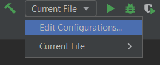
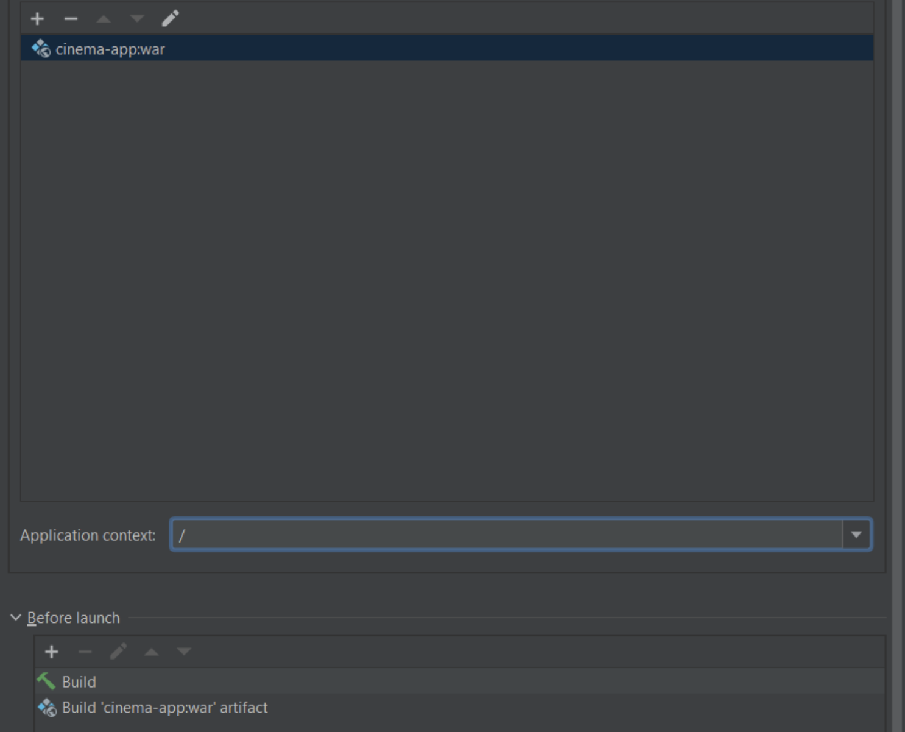

# Cinema-App

This is a web application designed for educational and demonstration purposes that simulates a ticket reservation system in a cinema.

## Principles and Architecture

The following principles were followed during the development of the program:

- REST API
- SOLID principles
- Dependency Injection (DI) / Inversion of Control (IoC)

Project is based on 3-layer architecture:

- Presentation layer (controllers)
- Application layer (services)
- Data access layer (DAO)

## Functionalities

The application provides the following functionalities:

- Register a new user
- Login (with username and password)
- Role-based authorization (admin, user)
- Exception handling (invalid username, password, invalid role) with descriptive messages

Project has multiple endpoints with user and admin access:

### User Access Endpoints

- POST: /register (create a user)
- POST: /orders/complete (create an order for the current user)
- PUT: /shopping-carts/movie-sessions (add a movie session to the shopping cart)
- GET: /orders (get order history for the current user)
- GET: /shopping-carts/by-user (get a shopping cart for the current user)
- GET: /cinema-halls (get all cinema halls)
- GET: /movies (get all movies)
- GET: /movie-sessions/available (get all available movies by date)

### Admin Access Endpoints

- POST: /cinema-halls (create a cinema hall)
- POST: /movies (create a movie)
- POST: /movie-sessions (create a movie session)
- PUT: /movie-sessions/{id} (update a movie session)
- DELETE: /movie-sessions/{id} (delete a movie session)
- GET: /users/by-email (find a user by email)

All endpoints send and receive JSON data, except for the login page, which is generated by Spring Security. Almost all endpoints are secured by role-based authorization. More details can be found in the SecurityConfig class.

## Package Structure

- config - stores Spring configuration
- controller - contains controllers for endpoints
- dao - data access layer (repository) that calls CRUD methods in the database
- dto - wrapper for model objects to unify the requests and responses in controllers
- lib - contains email and password validators with its annotations
- model - contains models for the database
- service - contains services that call repositories and the AuthenticationService class
- mapper - converts model objects to DTO objects

## Technologies

The application is built using the following technologies:

- Java 17
- Apache Maven 3.10.1
- Apache Tomcat 9.0.76
- MySQL Connector 8.0.22
- Hibernate 5.6.14.Final
- Spring:
    - Core 5.3.20
    - Web Mvc 5.3.20
    - Security 5.6.10

## How to Run and Test

## How to Run and Test

1. Clone the repository from GitHub
2. Create an empty database
3. Set up the database connection parameters by editing the resources/db.properties file.
4. Install Apache Tomcat version 9.x.x. You can download it from the official Apache Tomcat website: https://tomcat.apache.org/download-90.cgi. Choose the appropriate installation package for your operating system.
5. Install Postman for sending requests
6. Build the project using Maven: \`mvn clean install\`
7. Deploy the generated WAR file to a servlet container such as Tomcat

## Contacts

If you have any questions or suggestions, please feel free to contact me via [My LinkedIn](https://www.linkedin.com/in/anastasiia-variichuk/). I am open to new opportunities as a Java Developer.

